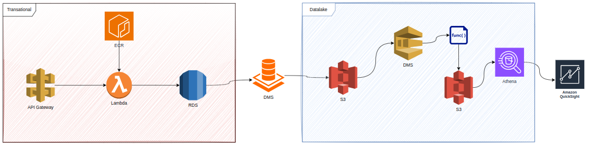
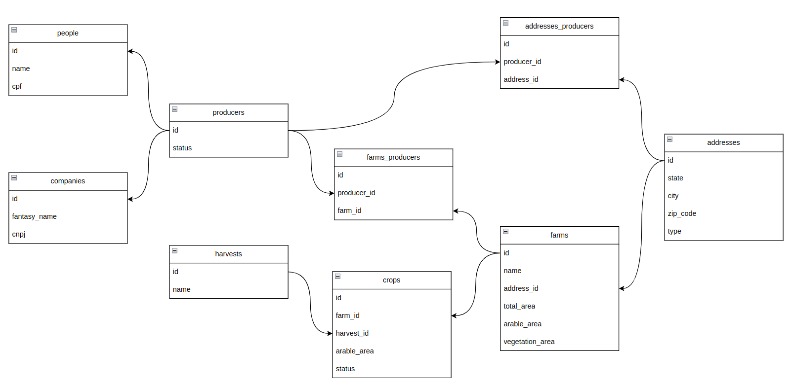

# Projeto
Desafio-SRS


## Arquitetura


## Modelagem Relacional


## Como funciona
- Crie um arquivo `.env` com base no arquivo `.env-sample`, preenche os valore que faltam.
- Iniciar o projeto `make up && make run`
    - Acesse http://localhost:8088/docs para ver a documentação da API
    - Abra um novo terminal no mesmo diretório para executar os demais comandos
- Criar registros básicos `make basics`
- Criar dados iniciais `make seeds`
- Executar testes `make test`
- Inicialziar Terraform `make tf-init`
- Planejar recursos `make tf-plan`
- Criar recursos `make tf-apply`
- Destruir recursos `make tf-tf-destroy`

## Queries
Total de fazendas cadastradas (quantidade).
```sql
SELECT count(*) as qty FROM farms   
```
```
count
-----
  500
```

Total de hectares registrados (área total).
```sql
SELECT sum(total_area) as sum_total_area FROM farms
```
```
sum_total_area
--------------
       2862300
```

Por estado.
```sql
SELECT
a.state,count(1) as qty,sum(total_area) as sum_total_area
FROM farms f
join addresses a on a.id=f.address_id
group by a.state
```
```
state                qty  sum_total_area
-------------------  ---  --------------
Maranhão              19          125250
Rio de Janeiro        21          133900
Paraíba               22          126900
São Paulo             27          147650
Sergipe               18           87650
Mato Grosso do Sul    21          152150
Ceará                 22          119350
Rio Grande do Norte   14           92450
Santa Catarina        21          115950
Alagoas               27          137050
Goiás                 13           81750
Amazonas              12           67500
Paraná                16           84800
Minas Gerais          21          106450
Rondônia              15           86150
Roraima               16           87350
Mato Grosso           17          108200
Bahia                  9           58550
Espírito Santo        19          106300
Rio Grande do Sul     26          152150
Pernambuco            15           69500
Amapá                 16           75150
Pará                  17          108900
Acre                  15           88300
Distrito Federal      22          115650
Piauí                 25          157150
Tocantins             14           70150
```
Por cultura plantada.
```sql
SELECT
c.plant_name,h.name,count(1) as qty,sum(total_area) as sum_total_area
FROM farms f
join crops c on c.farm_id=f.id
join harvests h on h.id=c.harvest_id
group by 1,2
```

```
plant_name    name  qty  sum_total_area
------------  ----  ---  --------------
milho         2022   23          149400
milho         2021   12           86800
grão de bico  2021   21          118650
café          2023   19          102600
feijão        2024   17           91750
milho         2024   17           75850
ervilha       2021   10           55200
milho         2020   21           89150
ervilha       2022   11           67100
feijão        2023   18           97100
grão de bico  2022   15           78100
café          2024   21          124550
ervilha       2024   23          141950
arroz         2024   19          113700
café          2021   12           76500
grão de bico  2023   21          127500
arroz         2020   14           80350
arroz         2023   10           66550
café          2022   13           88650
ervilha       2023   18          126600
milho         2023   11           60150
grão de bico  2020   20          116200
arroz         2022   15           76100
feijão        2022   18           96050
grão de bico  2024   20          124500
arroz         2021   23          139200
feijão        2021   11           76200
ervilha       2020   11           52400
café          2020   23          140400
feijão        2020   15           52850
```
Por uso do solo (área agricultável e vegetação).
```sql
SELECT sum(vegetation_area+arable_area) sum_land_use FROM farms
```

```
sum_land_use
------------
     2900350
```

## TO DO
- Autenticação
- CI/CD
- ETL
- Visualização dos dados 

## API doc:

[API](https://aow51d6ive.execute-api.us-east-1.amazonaws.com/dev/docs#/)